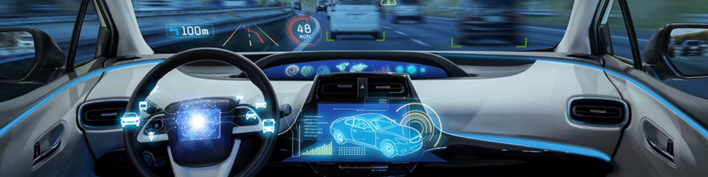

# 👋 Hello, I'm Mahmoud Ibrahim

## 🚀 About Me
I am a passionate Embedded Ssystem Engineer with over 3 years of hands-on studying in designing and developing innovative solutions for the embedded world. My journey in the field has equipped me with a deep understanding of hardware-software integration, real-time systems, and low-level programming.

## 🛠️ Skills
- **Programming Languages:** C, C++,  Embedded C/C++, VHDL, MATLAB
- **Microcontrollers:** STMicroelectronics MCUs , Microchip MCUs
- **Communication Protocols:** I2C, SPI, UART/USART/EUART, CAN, Ethernet, USB
- **Peripherals:**  DMA, Clock, Timer, Real Time Clock, GPIO, Interrupts, ADC, DAC, Watchdog, 
- **RTOS:** FreeRTOS
- **Embedded Software Development:** Bare-metal programming, Firmware development, Real-Time System development
- **Introduction To AUTOSAR **

## 🌐 Connect with Me
- [LinkedIn](https://www.linkedin.com/in/m-i-a-/)

## 📚 Education
- **Bachelor of Engineering in Electronics** from University of Menoufia (2020-2025)

## 🌱 Interests
Embedded systems, IoT, Robotics, Low-level programming, and Continuous learning.

### Languages
---

 

 

 

